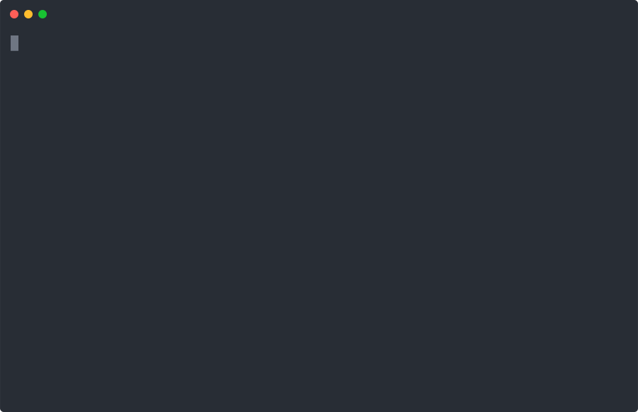
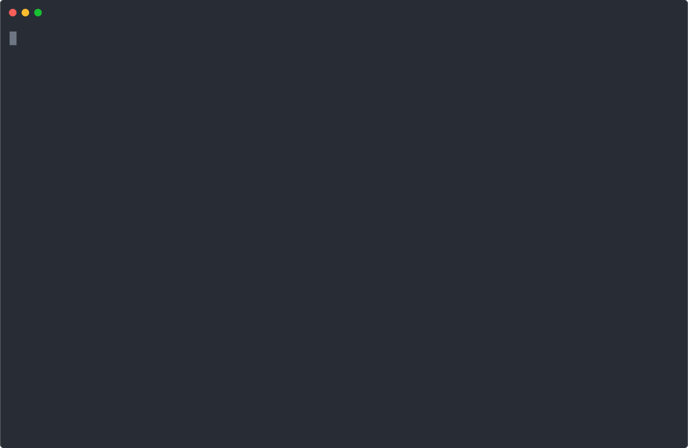

# Play and Record Demos with Ease
Playing and recording demos in terminal sessions has never been easier. This repository offers a guide and a tool for playing a terminal demo and recording it as SVG or mp4 vidoefiles using `asciinema`, `svg-term` and `svg-to-video`.

## Install dependencies manually (optional)
You can skip this step if you have `pip3` and `node.js/npm` installed on your machine. In this case, the script will automatically install `asciinema`, `svg-term` and `svg-to-video`for you.

1. Install `asciinema` (https://asciinema.org/docs/installation)
      ```sh
      pip3 install asciinema
      ```
2. Install`Node.js/npm` (https://docs.npmjs.com/downloading-and-installing-node-js-and-npm)
3. Install `svg-term-cli` (https://github.com/marionebl/svg-term-cli)
      ```sh
      npm install -g svg-term-cli
      ```
4. Install `svg-to-video` 
      ```sh
      npm install -g svg-to-video
     ``` 
5. Install `ffmpeg` if you need to record demos in mp4 video files (https://ffmpeg.org/download.html) 

## Usage
### Create a demo file
A demo file is a valid script that consists of:
- Comments and notes, each starting with `#`.
- Command lines containing valid commands that will execute during the demo.

Here's a simple example demo file: [simple.demo](examples/simple.demo). 

```
# This is a simple demo file

# Comment/note lines begin with '#'
# This is a comment.

# A command line is a valid command that will execute.
# List all files in the current directory
ls

# Show today's date
date

# Say Hello
echo "Hello, world!"

# Wait for 2 seconds
sleep 2

# That's it.
# Thank you for using recdemo!"

clear
```

### Play a demo and save it in a svg or mp4 file
 ```
  scripts/recdemo.sh <input> [output] [--help] [options...]
  <input> input file
  [output] output file: .svg to record in a svg file (default), .cast in a cast file, .mp4 in a video file
  --help show this help
  --cols cols of the terminal
  --rows rows of the terminal
  --ps1 ps1 of the recording
  --term terminal type
```
 ```sh
   ./scripts/recdemo.sh examples/simple.demo examples/simple-demo.svg
```
or 

 ```sh
   ./scripts/recdemo.sh examples/simple.demo examples/simple-demo.mp4
```

### Play a genereated svg file
Open the svg file `simple-demo.svg` or `simple-demo.mp4` that was generated in the previous step.

<p align="center">
  
</p>

Download the generated [mp4 video file](examples/simple-demo.mp4">

## A more realistic demo 

Here is a recorded demo about how to use minikube to play with kubernetes on my Mac.
- Input: [minikube.demo](examples/minikube.demo)
- Output: [minikube-demo.svg](examples/minikube-demo.svg)

<p align="center">
  
</p>

## TO DO
Add the support for recording a demo in a video file by converting svg to mp4. 

## Contributions

Contributions are welcome!

## Acknowledgement

The tool `recdemo.sh` was adapted from a script that was originally created by @wzshiming for the `kwok` project: https://kwok.sigs.k8s.io/.
